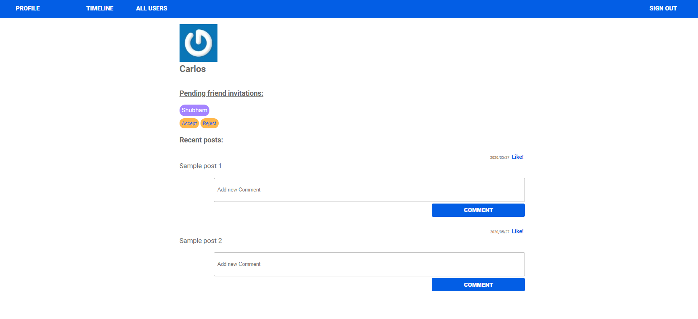
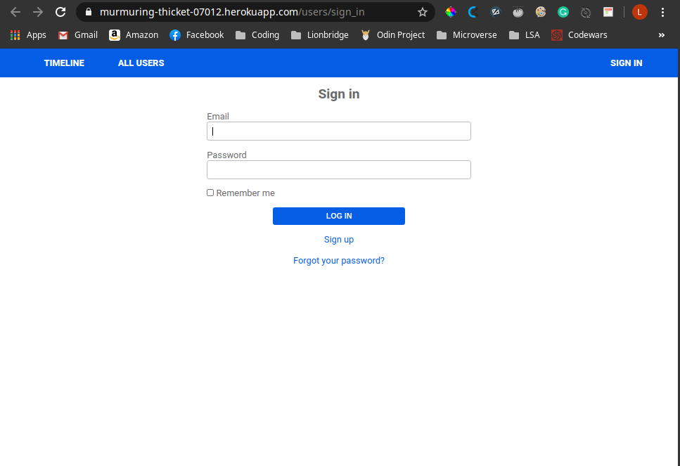

# Social Media App with Ruby on Rails

> This milestone was to create the Friendship model, the associations, and the tests for friendship and users.





## Built With

- Ruby v2.6.5
- Ruby on Rails v5.2.4

## Getting Started

To get started with the app, cd to the directory where you would like the repo to live by typing on your terminal:

```
$ cd <directory>
```

Clone the repo typing:

```
$ git clone git@github.com:shubham14p3/ror-social-scaffold.git
```

Install the needed gems:

```
$ bundle install
```

Next, migrate the database:

```
$ rails db:migrate
```

Finally, start server:

```
$ rails server
```

Open `http://localhost:3000/` in your browser.

### Prerequisites

Ruby: 2.6.3
Rails: 5.2.3
Postgres: >=9.5

### Run tests

```
    rpsec spec/features/users/create_spec.rb
```

## Authors

👤 **Luis Angel Maldonado**

- Github: [@lmaldonadoch](https://github.com/lmaldonadoch)
- Twitter: [@LuisAngelMCh](https://twitter.com/LuisAngelMCh)
- Linkedin: [linkedin](https://www.linkedin.com/in/lmaldonadoch)

👤 **Shubham Raj**

- Github: [@ShubhamRaj](https://github.com/shubham14p3)
- Linkedin: [Shubham14p3](https://www.linkedin.com/in/shubham14p3/)

## 🤝 Contributing

Contributions, issues and feature requests are welcome!

Feel free to check the [issues page](https://github.com/shubham14p3//ror-social-scaffold/issues/).

## Show your support

Give a ⭐️ if you like this project!

## Acknowledgments

- Project requested by [Microverse Program](https://www.microverse.org/).
